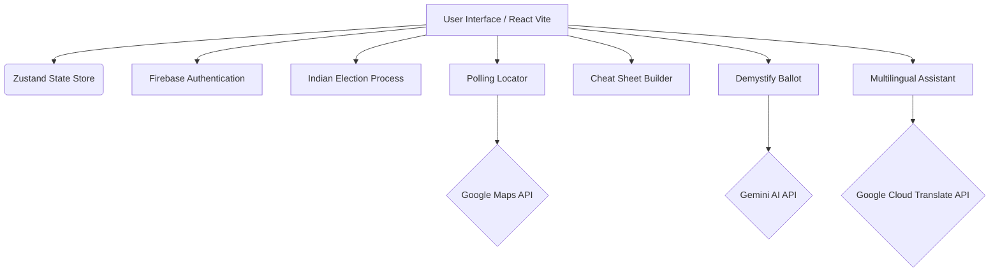

# CivicSync

CivicSync is a comprehensive, non-partisan platform designed to empower voters with accessible, understandable, and actionable electoral information. It simplifies the voting process, helps users prepare for election day, and leverages AI to demystify complex political language.

## 🌟 Features

*   **Voter Roadmap**: A personalized countdown to Election Day with actionable steps.
*   **Indian Election Process Guide**: An interactive, animated 6-step journey explaining how the world's largest democracy conducts elections (from Announcement to Government Formation).
*   **Polling Locator**: Find your nearest polling places using interactive Google Maps integration.
*   **Ballot Cheat Sheet Builder**: Prepare your ballot choices in advance by reviewing propositions and marking your stance (Yes/No). Features a **PDF Export** to safely print and take your ballot choices to the booth.
*   **AI-Powered Demystify Ballot**: Translate complex legal jargon from ballot measures into plain, 5th-grade level English, complete with non-partisan pros and cons using Gemini Models.
*   **Multilingual Civic Assistant**: An AI chatbot ready to answer your election questions with on-the-fly language translating using Google Cloud Translate API. Supports English, Spanish, Chinese, and Hindi.
*   **Glossary Hover**: Instantly define difficult civic and electoral terms using AI-generated short definitions.
*   **Firebase Authentication**: Securely sync your profile and language preferences across devices with Google Sign-In.

## 🏗️ Architecture



## 🚀 Getting Started

### Prerequisites

*   Node.js (v18+)
*   npm or yarn
*   Firebase Project (for Authentication & Sync)
*   Google Cloud Services (Cloud Translate API & Maps JavaScript API enabled)

### Installation

1.  **Clone the repository:**
    ```bash
    git clone <repository-url>
    cd <project-directory>
    ```

2.  **Install dependencies:**
    ```bash
    npm install
    ```

3.  **Configure Environment Variables:**
    Create a `.env` file in the root directory and add your API keys:
    ```env
    # VITE_GEMINI_API_KEY: Required for Gemini Models
    VITE_GEMINI_API_KEY=your_gemini_api_key_here

    # VITE_GOOGLE_CLOUD_API_KEY: Required for Google Maps and Cloud Translation API integration.
    VITE_GOOGLE_CLOUD_API_KEY=your_google_cloud_api_key_here
    ```

    Also make sure `firebase-applet-config.json` exists in root with Firebase App configuration.

4.  **Run the Development Server (Full-Stack mode):**
    ```bash
    npm run dev
    ```

## 🛠️ Technology Stack

*   **Frontend**: React 18, TypeScript, Vite
*   **Backend Proxy**: Express Server setup to proxy API requests securely
*   **Styling**: Tailwind CSS
*   **State Management**: Zustand
*   **Authentication**: Firebase Auth
*   **Animations**: Motion (Framer Motion)
*   **Icons**: Lucide React
*   **Export**: html-to-image, jspdf
*   **Cloud Services**: Google Cloud Translation, Google Maps, Gemini Flash Models

## 🔒 Non-Partisan Commitment

CivicSync is built with a strict commitment to non-partisanship. All AI prompts are heavily guarded to act as non-partisan civic educators, ensuring translations and answers remain objective, factual, and devoid of political bias.
