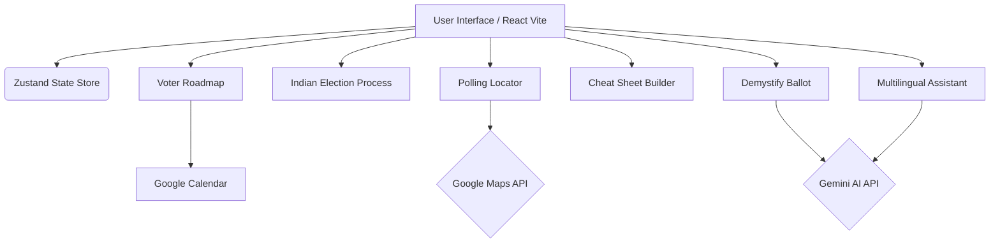
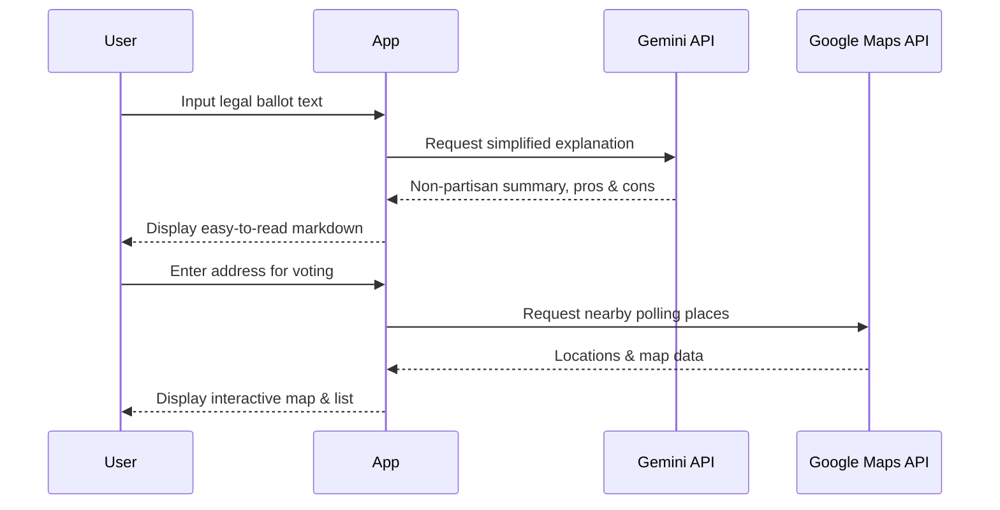

# CivicSync

CivicSync is a comprehensive, non-partisan platform designed to empower voters with accessible, understandable, and actionable electoral information. It simplifies the voting process, helps users prepare for election day, and leverages AI to demystify complex political language.

## 🌟 Features

*   **Voter Roadmap**: A personalized countdown to Election Day with actionable steps. Includes an option to sync reminders to your Google Calendar.
*   **Indian Election Process Guide**: An interactive, animated 6-step journey explaining how the world's largest democracy conducts elections (from Announcement to Government Formation).
*   **Polling Locator**: Find your nearest polling places using interactive Google Maps integration.
*   **Ballot Cheat Sheet Builder**: Prepare your ballot choices in advance by reviewing propositions and marking your stance (Yes/No).
*   **AI-Powered Demystify Ballot**: Translate complex legal jargon from ballot measures into plain, 5th-grade level English, complete with non-partisan pros and cons.
*   **Multilingual Civic Assistant**: An AI chatbot ready to answer your election questions in English, Spanish, and Hindi.
*   **Glossary Hover**: Instantly define difficult civic and electoral terms using AI-generated short definitions.

## 🏗️ Architecture



## 🚀 Getting Started

### Prerequisites

*   Node.js (v18+)
*   npm or yarn
*   Google Gemini API Key
*   Google Maps API Key (with Maps JavaScript API enabled)

### Installation

1.  **Clone the repository:**
    ```bash
    git clone <repository-url>
    cd <project-directory>
    ```

2.  **Install dependencies:**
    ```bash
    npm install
    ```

3.  **Configure Environment Variables:**
    Create a `.env` file in the root directory and add your API keys:
    ```env
    GEMINI_API_KEY=your_gemini_api_key_here
    VITE_GOOGLE_MAPS_API_KEY=your_google_maps_api_key_here
    ```

4.  **Run the Development Server:**
    ```bash
    npm run dev
    ```

## 🛠️ Technology Stack

*   **Frontend**: React 18, TypeScript, Vite
*   **Styling**: Tailwind CSS
*   **State Management**: Zustand
*   **Animations**: Motion (Framer Motion)
*   **Icons**: Lucide React
*   **Formatting/Sanitization**: DOMPurify, marked
*   **Maps**: `@vis.gl/react-google-maps`
*   **AI**: `@google/genai` (Gemini Flash Models)

## 🗺️ Application Flow



## 🔒 Non-Partisan Commitment

CivicSync is built with a strict commitment to non-partisanship. All AI prompts are heavily guarded to act as non-partisan civic educators, ensuring translations and answers remain objective, factual, and devoid of political bias.
